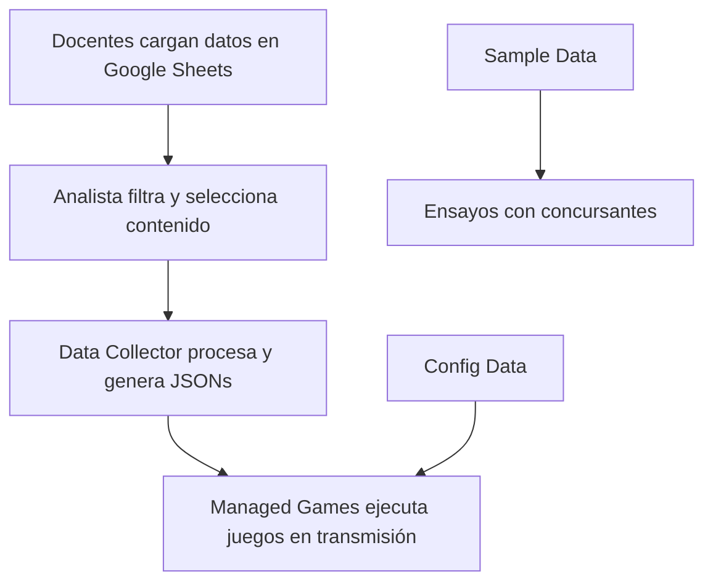

# TV Perú - Que Gane El Mejor - App Center

**App Center** es una plataforma web desarrollada con **Next.js 15** y **TailwindCSS**, diseñada como sistema centralizado para la gestión de juegos educativos del programa de televisión *"Que Gane El Mejor"* de TV Perú.

## 📺 Descripción del Proyecto

El sistema funciona como **centro de control unificado** para la producción del programa, proporcionando herramientas especializadas para la gestión de datos de concurso y aplicaciones Unity WebGL que se ejecutan durante las transmisiones en vivo. Permite a los analistas de datos y al equipo de producción manejar contenido educativo de manera eficiente y sin dependencias de dispositivos físicos.

## 🎯 Contexto del Programa

*"Que Gane El Mejor"* es un programa de concursos educativos donde **dos colegios compiten** en juegos de conocimientos. El App Center centraliza toda la gestión tecnológica necesaria para:

- Procesamiento de datos de concurso proporcionados por docentes
- Gestión de contenido educativo (preguntas, imágenes, configuraciones)
- Ejecución de juegos interactivos durante la transmisión en vivo
- Administración de datos de muestra para ensayos con concursantes

## 🔄 Flujo de Trabajo del Sistema



1. **Docentes** cargan datos educativos en Google Sheets
2. **Analista de datos** filtra y selecciona preguntas/temas para el día
3. **Data Collector** procesa la información y genera archivos JSON (uno por juego)
4. **Managed Games** utiliza estos datos durante la transmisión en vivo

## ✨ Características Principales

### 🎮 Aplicaciones Unity WebGL

- **Data Collector**: Herramienta de procesamiento de datos educativos
- **Managed Games**: Sistema principal para ejecutar juegos durante transmisiones

### 📊 Sistema de Storage Inteligente

- **Eliminación total de dispositivos USB físicos**
- **3 buckets especializados** en Supabase Storage:
  - `current-data`: Datos para el programa del día actual
  - `sample-data`: Datos de ejemplo para ensayos y pruebas
  - `config-data`: Configuraciones de tiempo y parámetros de juego

### 🔌 API REST Integrada

- **Endpoints especializados** para gestión de archivos JSON
- **Consumo dual**: Sistema interno y Google Apps Script
- **Operaciones CRUD** completas para todos los buckets

### 🗂️ Explorador de Storage

- **Navegación visual** del contenido almacenado
- **Descarga directa** de archivos JSON
- **Metadatos detallados** (fecha de modificación, tamaño, tipo)
- **Navegación por carpetas** dentro de cada bucket

## 🎨 Diseño y Experiencia de Usuario

### Sistema de Diseño

- **Estilo Visual**: Glassmorphism con elementos translúcidos y efectos de profundidad
- **Justificación**: Interfaz moderna que reduce la fatiga visual durante transmisiones largas
- **Paleta**: Gradientes oscuros con acentos en rojo (branding TV Perú)
- **Componentes**: Biblioteca UI centralizada en `/src/components/ui/`

### Consideraciones UX

- **Contraste optimizado** para uso en estudios con iluminación variable
- **Elementos translúcidos** que permiten ver contenido subyacente sin obstaculizar
- **Jerarquía visual clara** para operación rápida durante transmisiones en vivo

## 🏗️ Arquitectura del Sistema

### Frontend (tvperu-qgem-appcenter)

- **Despliegue**: Vercel (servicio estático)
- **Función**: Interfaz gráfica y hosting de aplicaciones Unity WebGL
- **Disponibilidad**: Constante durante emisiones
- **Independencia**: Funciona sin dependencias del backend

### Backend (Supabase Storage)

- **Servicio**: Supabase Storage como backend
- **Función**: Almacenamiento seguro y gestión de archivos JSON
- **Escalabilidad**: Preparado para futuras integraciones (Auth, Database, Monitoring)

## 🚀 Comenzar a Desarrollar

### Prerrequisitos

```bash
Node.js 18+ y npm/yarn/pnpm
```

### Instalación

```bash
# Clonar el repositorio
git clone https://github.com/BroadStream-Coders/TvPeru-QGEM-AppCenter.git
cd tvperu-qgem-appcenter

# Instalar dependencias
npm install

# Configurar variables de entorno
cp .env.example .env
# Editar .env con las credenciales de Supabase
```

### Variables de Entorno

```bash
# Supabase Configuration
SUPABASE_URL=
NEXT_PUBLIC_SUPABASE_ANON_KEY=

# Server secret
SUPABASE_SERVICE_ROLE_KEY=

# Key Access
ACCESS_ISSUE_ENABLED=
```

### Desarrollo

```bash
npm run dev          # Servidor de desarrollo con Turbopack
npm run build        # Build para producción
npm run start        # Servidor de producción
npm run lint         # Verificación de código
```

## 📁 Estructura del Proyecto

```cmd
tvperu-qgem-appcenter/
├── public/
│   └── unity/                    # Builds Unity WebGL
│       ├── data-collector/       # Herramienta de procesamiento
│       └── managed-games/        # Sistema de juegos principal
├── src/
│   ├── app/
│   │   ├── api/                  # API Routes para Storage
│   │   │   └── [bucket]/         # Endpoints dinámicos por bucket
│   │   ├── storage/              # Explorador de buckets
│   │   └── unity/                # Interfaces para apps Unity
│   ├── components/               # Componentes React reutilizables
│   └── lib/                      # Configuraciones (Supabase)
└── ...
```

## 🎮 Aplicaciones Disponibles

### Data Collector (`/unity/data-collector`)

- **Propósito**: Procesamiento de datos educativos
- **Input**: Datos filtrados por analistas
- **Output**: Archivos JSON estructurados por juego
- **Estado futuro**: Migración completa a Google Sheets

### Managed Games (`/unity/managed-games`)

- **Propósito**: Ejecución de juegos durante transmisiones
- **Funcionalidad**: Selector de recursos y configuración dinámica
- **Input**: JSONs del Data Collector + configuraciones
- **Uso**: Transmisión en vivo del programa

## 🗂️ Sistema de Storage

### Buckets Especializados

| Bucket | Propósito | Uso Principal | Actualización |
|--------|-----------|---------------|---------------|
| `current-data` | Datos del programa actual | Transmisión en vivo | Diaria (día del programa) |
| `sample-data` | Datos de ejemplo | Ensayos con concursantes | Esporádica |
| `config-data` | Configuraciones | Parámetros de juego | Según necesidad |

### API Endpoints

```bash
# Listar contenido de bucket
GET /api/{bucket}

# Obtener archivo específico
GET /api/{bucket}/{filename}

# Subir/actualizar archivo
POST /api/{bucket}/{filename}
```

## 🌐 Integraciones Externas

### Google Apps Script

- **Conexión**: Consume API REST del App Center
- **Propósito**: Sincronización con Google Sheets
- **Flujo**: Sheets → Apps Script → App Center API

### TV Perú - Producción

- **Acceso**: Interfaz web directa
- **Usuarios**: Analistas de datos y equipo de producción
- **Dispositivos**: Cualquier navegador web moderno

## 📈 Estado del Proyecto

- **Versión actual**: v1.0.0
- **Estado**: Pre-producción (listo para despliegue)
- **Inicio en producción**: 3 semanas aproximadamente
- **Mantenimiento**: Desarrollo independiente

## 🛠️ Tecnologías Utilizadas

| Tecnología | Versión | Propósito |
|------------|---------|-----------|
| **Next.js** | 15.5.2 | Framework principal con App Router |
| **React** | 19.1.0 | Biblioteca de UI |
| **TailwindCSS** | 4.0 | Framework de estilos |
| **TypeScript** | 5+ | Tipado estático |
| **Supabase** | 2.57.0 | Backend como servicio |
| **Unity WebGL** | 2023.3+ | Motor de juegos web |

## 🚀 Despliegue

### Producción

- **Plataforma**: Vercel
- **URL**: `https://tv-peru-qgem-app-center.vercel.app/`
- **Configuración**: Automática desde GitHub

### Consideraciones

- **Alta disponibilidad**: Frontend independiente del backend
- **Tolerancia a fallos**: Funcionamiento garantizado durante transmisiones
- **Escalabilidad**: Preparado para crecimiento de usuarios y contenido

## 🤝 Desarrollo y Mantenimiento

Este proyecto ha sido desarrollado como **servicio independiente** para TV Perú bajo la modalidad de desarrollo freelance. El sistema está diseñado para ser **autosuficiente** y requerir **mínimo mantenimiento** durante las operaciones del programa.

### Características de Mantenimiento

- **Actualizaciones automáticas** vía Vercel
- **Backups automáticos** en Supabase
- **Monitoreo integrado** del estado del sistema
- **Arquitectura resiliente** ante fallos parciales

## 📄 Licencia

**Todos los derechos reservados.** Copyright (c) 2025 Esteban Abanto Garcia.

Este software fue desarrollado bajo contrato de servicios independientes para TV Perú - Instituto Nacional de Radio y Televisión del Perú, para el programa "Que Gane El Mejor". La propiedad intelectual del código fuente y arquitectura pertenece al desarrollador.

**Contacto para soporte técnico:** <esteban.abanto.2709@gmail.com>

---

**Cliente:** TV Perú - Instituto Nacional de Radio y Televisión del Perú  
**Programa:** "Que Gane El Mejor"  
**Modalidad:** Desarrollo independiente (Freelance)  
**Versión del Sistema:** v1.0.0
